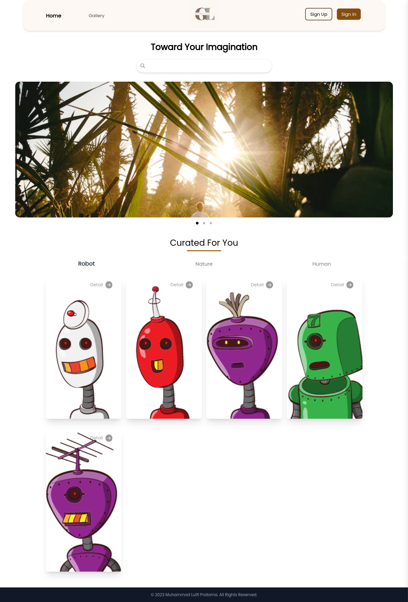
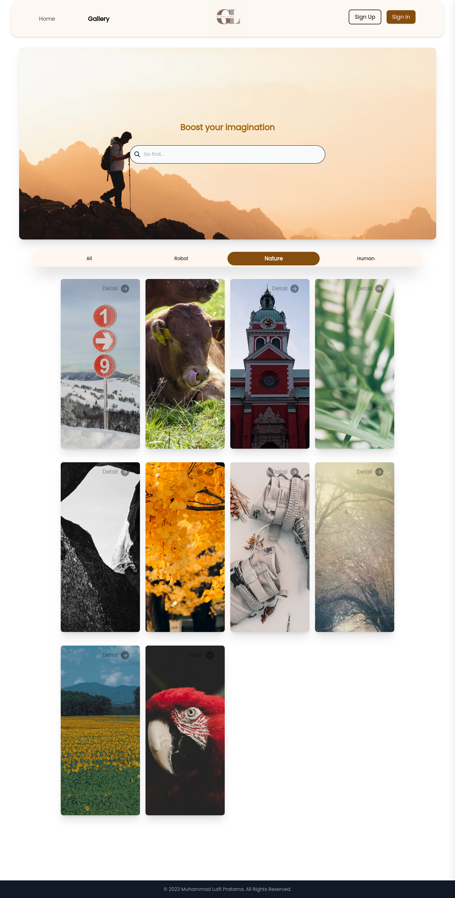
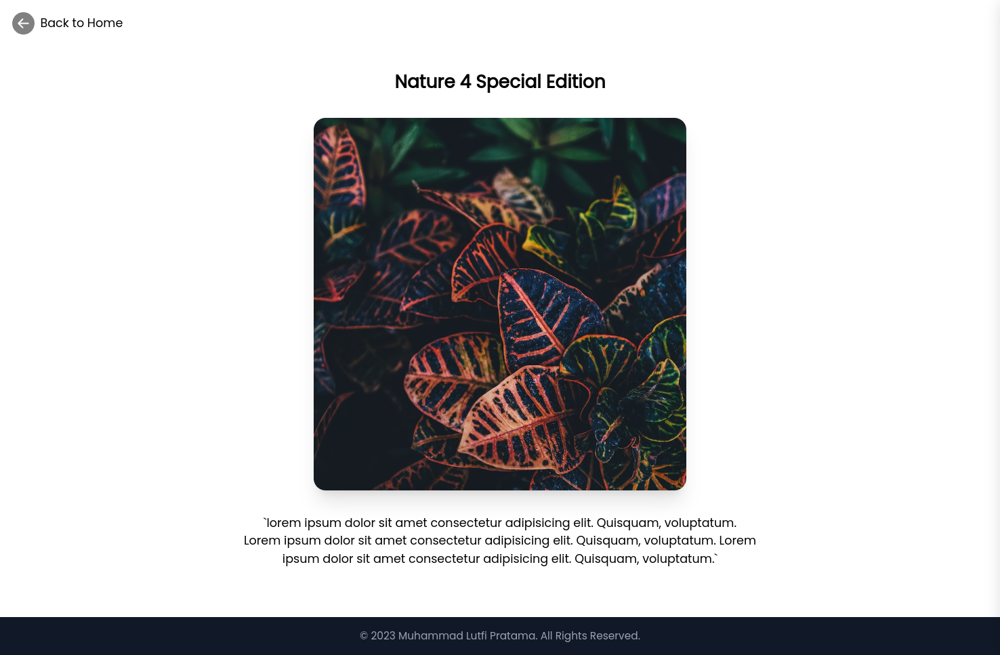
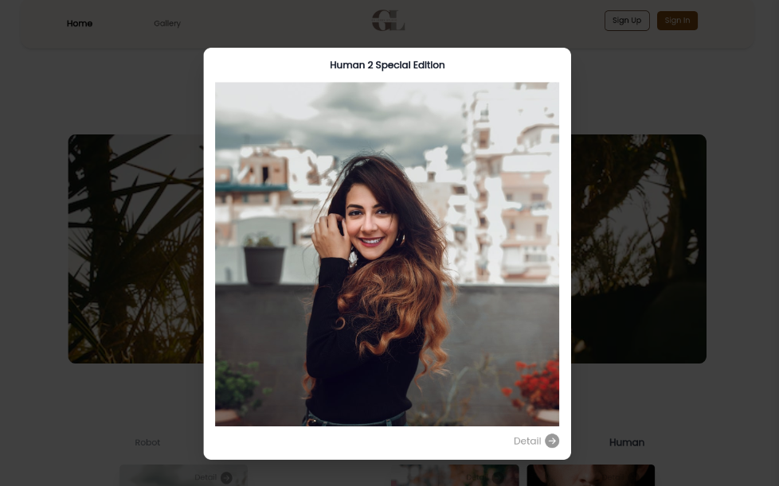

# Gallery-App React Application

Front-End web development bootstrapped with [Create React App](https://github.com/facebook/create-react-app).

## Requirements

The minimum requirements:

- Using React Components
- Using React Navigation
- Neat UI/UX arrangement

## Main point

- Employ Tailwind CSS
- Utilized React Router
- Searching feature
- Filter by category feature
- Responsive design
- Using React Hooks
- Clean code
- Structured folder and React Components

## Screenshots

|        |
| :-------------------------------------------------: |
|                     _Home Page_                     |
|  |
|     :-----------------------------------------:     |
|                   _Gallery Page_                    |
|    |
|     :-----------------------------------------:     |
|                    _Detail Page_                    |
|   |
|     :-----------------------------------------:     |
|                 _Modal Card Image_                  |

# Getting Started with Create React App

This project was bootstrapped with [Create React App](https://github.com/facebook/create-react-app).

## Available Scripts

In the project directory, you can run:

### `npm start`

Runs the app in the development mode.\
Open [http://localhost:3000](http://localhost:3000) to view it in your browser.

The page will reload when you make changes.\
You may also see any lint errors in the console.

### Deployment

This section has moved here: [https://facebook.github.io/create-react-app/docs/deployment](https://facebook.github.io/create-react-app/docs/deployment)
